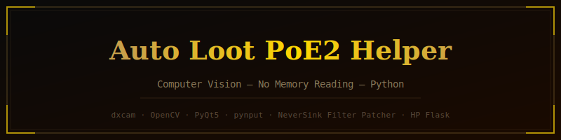

<div align="center">
  
</div>

# Auto Loot PoE2 Helper

**Path of Exile 2** 自动拾取助手。纯截图识别——基于计算机视觉，不读取游戏内存。

> ⚠️ 第三方自动化违反 GGG 服务条款，可能导致账号封禁。使用风险自负。

---

## 工作原理

```
物品过滤器 (NeverSink / 一乐)
  │
  ├── filter_patcher.py — 扫描现有 Show 块
  │     给通货/碎片/宝石/路标石追加粉色标记 RGB(255,0,200)
  │     (该颜色在 PoE2 场景中不存在 → 零误触发)
  │
  └── 游戏按过滤器渲染物品标签
        │
        ▼
  capture/screen.py — 捕获窗口帧 (dxcam 60fps)
        │
        ▼
  vision/color_detector.py — HSV 遮罩 → 搜索标记颜色像素 → 轮廓 → 中心点
        │
        ▼
  core/loot_engine.py — 按优先级排序目标 (通货 > 碎片 > 宝石 > 路标石)
        │                按距屏幕中心半径过滤、队列、防双击
        ▼
  input/mouse.py — 贝塞尔曲线移动 + 点击 (模拟人手操作)
```

主循环：**捕获 → 检测 → 排序 → 点击**。就这么简单。

---

## 功能

### 物品拾取

仅拾取"小件物品"——在 `config/default.yaml` 中配置：

| 分类 | 拾取内容 |
|------|----------|
| `currency` | 混沌石、神圣石、崇高石等 |
| `fragments` | 碎片、地图碎片 |
| `gems` | 未切割技能/辅助/灵魂宝石 |
| `waystones` | 地图路标石 |

传说装备、稀有装备和白色垃圾**不会拾取**，自己手动捡。

**优先级：** 通货 → 碎片 → 宝石 → 路标石。同分类内优先拾取最近的。

### 拾取模式

| 模式 | 说明 |
|------|------|
| `toggle` | 按 F8 开关。开启后全自动拾取 |
| `hold` | 按住拾取键时持续拾取 |
| `single` | 每按一次拾取一个 |
| `lazy` | 鼠标指向物品自动拾取 |

### 快捷键

| 按键 | 功能 |
|------|------|
| F8 | 总开关 (自动拾取 + 自动化) |
| F7 | 循环切换配置 |
| F12 | 退出 |

### 浮窗

覆盖在游戏上的半透明窗口：
- 状态：运行中 / 空闲，当前模式和配置
- 画面内目标数 / 拾取半径内目标数
- 拾取计数：`cur:47  frag:12  gem:3`
- HP%（如启用自动药水）

### 自动生命药剂

通过颜色检测监控血量球。HP 低于阈值时自动按药水键。

```yaml
hp_flask:
  enabled: true
  key: "1"
  threshold: 0.65
  cooldown_ms: 4500
```

自动校准：前 6 秒记录最大值（满血），以此为标准归一化。

### 定时自动化

配置中的 `automation` 节——按固定间隔自动使用药水/技能。默认关闭。仅在 F8 总开关开启且游戏窗口在前台时生效。

### 配置文件

`config/profiles/<name>.yaml`——覆盖 `default.yaml` 中的值：

| 配置 | 用途 |
|------|------|
| `calibrated` | 校准后的最佳设置 |
| `fast` | 高帧率、快速拾取 |
| `mapping` | 扩大拾取半径 |
| `bossing` | 打 BOSS 专用（仅通货、小范围） |

按 F7 随时切换。指定配置启动：`--profile calibrated`。

### 过滤器补丁

```powershell
python -m src.core.filter_patcher --check     # 检查状态
python -m src.core.filter_patcher --patch     # 追加粉色标记（自动备份 → *.filter.bak）
python -m src.core.filter_patcher --unpatch   # 回滚
python -m src.core.filter_patcher --scan-colors  # 扫描过滤器原生颜色
```

补丁后：Escape → 选项 → UI → 在游戏中重新选择过滤器。

### 颜色校准

```powershell
python -m src.calibrate
python -m src.calibrate --target myprofile
```

- 左键 — 从屏幕取色
- Shift+左键 — 设置角色中心
- 滑块 — 色容差/饱和度/亮度/面积/半径
- `s` — 保存配置
- `d` — 保存调试截图到 `_debug/`
- `q` — 退出

---

## 安装

### 依赖

```powershell
pip install -r requirements.txt
```

**包含：**
- `dxcam` — 高速屏幕捕获 (DirectX)
- `opencv-python` + `numpy` — 计算机视觉
- `pynput` — 鼠标/键盘 + 全局快捷键
- `pywin32` — 查找 PoE2 窗口、焦点检测
- `PyYAML` — 配置文件
- `PyQt5` — GUI 界面
- `vgamepad` — 虚拟 Xbox 手柄 (手柄模式)

### 手柄 (DualSense → Xbox)

使用手柄需安装 **DS4Windows**：

1. 从 https://github.com/ds4windowsapp/DS4Windows/releases 下载
2. 安装 ViGEmBus 驱动（安装包自带）
3. 通过 USB 或蓝牙连接 DualSense
4. 在 DS4Windows 中配置按键映射 (Profiles → Edit)

**PoE2 默认映射：**

| DualSense | Xbox | PoE2 功能 |
|-----------|------|-----------|
| Cross (X) | A | 拾取物品 |
| Square | X | 攻击 |
| Triangle | Y | 技能 2 |
| Circle | B | 闪避 |
| L1 | LB | 药剂 (魔力) |
| L2 | LT | 药剂 (生命) |
| R3 | Right Stick Click | 切换武器组 |
| D-pad Up | D-pad Up | 高亮物品 |
| D-pad Down | D-pad Down | 地图 |
| D-pad Left | D-pad Left | 背包 |
| D-pad Right | D-pad Right | 传送门 |

### 启动

```powershell
python -m src.main                          # 标准启动
python -m src.main --profile mapping        # 指定配置
python -m src.main --no-overlay             # 无浮窗
python -m src.main --gui                    # GUI 界面
python -m src.main --calibrate              # 校准窗口（显示目标高亮）
```

也可以直接双击 `run_gui.bat`。

### 测试

```powershell
python -m pytest
```

---

## 项目结构

```
Auto Loot PoE2 Helper/
├── config/
│   ├── default.yaml           # 基础配置
│   ├── gamepad/               # 手柄映射
│   └── profiles/              # 配置文件 (calibrated, mapping, bossing 等)
├── src/
│   ├── main.py                # 入口、主循环
│   ├── calibrate.py           # 颜色校准向导
│   ├── config_manager.py      # 配置加载/合并
│   ├── logger.py              # 日志
│   ├── capture/
│   │   ├── window.py          # 查找 PoE2 窗口、几何、焦点
│   │   └── screen.py          # 画面捕获 (dxcam → mss 回退)
│   ├── vision/
│   │   ├── color_detector.py  # HSV 遮罩 → 标记颜色检测
│   │   └── hp_detector.py     # 血量球颜色检测
│   ├── input/
│   │   ├── mouse.py           # 贝塞尔曲线移动 + 随机延迟点击
│   │   ├── keyboard.py        # 全局快捷键
│   │   ├── gamepad.py         # 虚拟 Xbox 手柄 (vgamepad)
│   │   └── dualsense_bridge.py # DualSense → 虚拟 Xbox 桥接
│   ├── core/
│   │   ├── loot_engine.py     # 目标队列、优先级、防双击
│   │   ├── filter_patcher.py  # 过滤器补丁注入
│   │   ├── hp_watcher.py      # HP 监控 + 自动药水
│   │   ├── automation.py      # 定时技能/药水自动化
│   │   └── profiles.py        # 配置加载/切换
│   └── ui/
│       └── overlay.py         # 游戏上方透明浮窗
├── tests/                     # pytest 测试
├── tools/                     # 调试脚本 (画面分析、HP)
├── PLAN.md                    # 实现计划
└── requirements.txt
```

---

## 配置说明

全部配置在 `config/default.yaml`。主要节点：

```yaml
filter:
  path: "C:/Users/OLD/Documents/My Games/Path of Exile 2/YourFilter.filter"
  marker_rgb: [255, 0, 200]
  categories: [currency, fragments, gems, waystones]

vision:
  hue_tolerance: 8
  sat_min: 120
  val_min: 120
  min_blob_area: 120

loot:
  pickup_radius_px: 250
  click_cooldown_ms: 100
  randomize_delay_ms: [5, 15]
  mode: toggle
  category_priority:
    currency: 1
    fragments: 2
    gems: 3
    waystones: 4

hotkeys:
  toggle: "f8"
  pickup: "space"
  quit: "f12"
```

配置文件只覆盖需要修改的字段——其余继承自 `default.yaml`。

---

## 许可证

MIT
